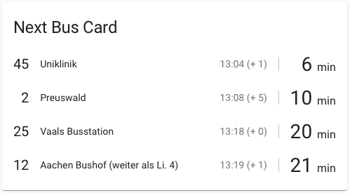

# Next Bus card for Home Assistant

Custom [Home Assistant](https://www.home-assistant.io) Lovelace card to display next bus information



## Installation

### Requirements

Make sure you have already setup the custom component [ASEAG Next Bus](https://github.com/davidorlea/homeassistant-aseag_next_bus) in configuration mode `list` in your Home Assistant instance:

```yaml
sensor:
  - platform: aseag_next_bus
    name: aseag_next_bus
    mode: list
    stop_id: 12345
    track: 'H.1'
```

### Step 1

Copy `dist/next-bus-card.js` from this repository to your local Home Assistant instance, e.g. `<config directory>/www/next-bus-card/next-bus-card.js`.

### Step 2

Add a Lovelace resource reference in your `configuration.yaml` when Lovelace mode is YAML, otherwise manage resources in the Lovelace configuration UI panel:

```yaml
lovelace:
  mode: yaml
  resources:
    - url: local/next-bus-card/next-bus-card.js
      type: module
```

### Step 3

Add a Lovelace custom card of type `custom:next-bus-card` in your `ui-lovelace.yaml` referencing your [ASEAG Next Bus](https://github.com/davidorlea/homeassistant-aseag_next_bus) sensor:

```yaml
views:
  - title: Travel
    cards:
      - type: custom:next-bus-card
        entity: sensor.aseag_next_bus
```

## Configuration Options

| Name | Type | Description | Default |
| ---- | ---- | ----------- | ------- |
| `type` | string | Card type is always `custom:next-bus-card` | **Required** |
| `entity` | string | `entity_id` of a sensor from custom component [ASEAG Next Bus](https://github.com/davidorlea/homeassistant-aseag_next_bus) | **Required** |
| `title` | string | Title of the card | No title |
| `size` | number | Number of departures to show | `5` |
| `threshold` | number | Minumum departure time to show | `1` |
| `include` | list of strings | Include only departures of these lines | Include all |
| `exclude` | list of strings | Exclude departures of these lines | Exclude none |

## Configuration Examples

### Example 1

Show the upcoming 3 departures of the lines 1, 5A and 10 with a departure time of at least 5 minutes:

```yaml
views:
  - title: Travel
    cards:
      - type: custom:next-bus-card
        entity: sensor.aseag_next_bus
        title: Example 1
        size: 3
        threshold: 5
        include:
          - '1'
          - '5A'
          - '10'
```

### Example 2

Show the upcoming 5 departures (default) of all lines excluding 3 and SB6 with a departure time of at least 1 minute (default):

```yaml
views:
  - title: Travel
    cards:
      - type: custom:next-bus-card
        entity: sensor.aseag_next_bus
        title: Example 2
        exclude:
          - '3'
          - 'SB6'
```

